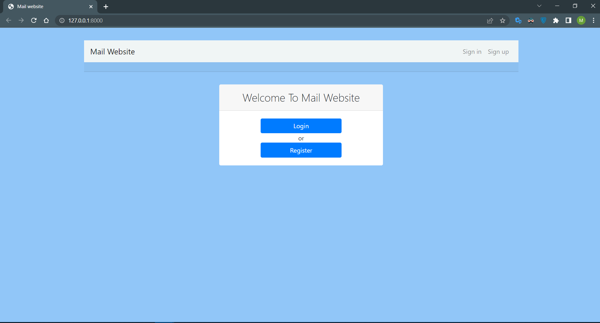
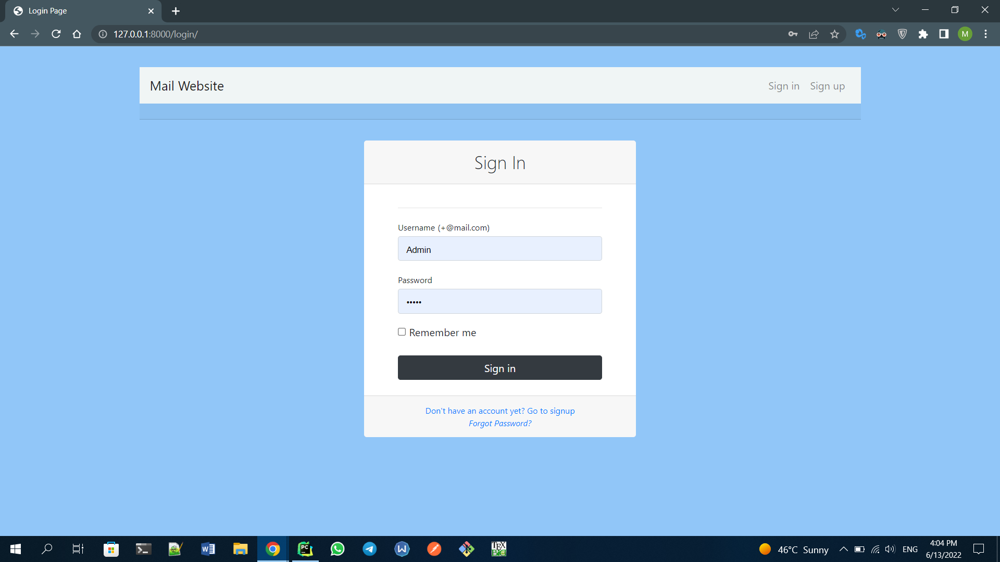
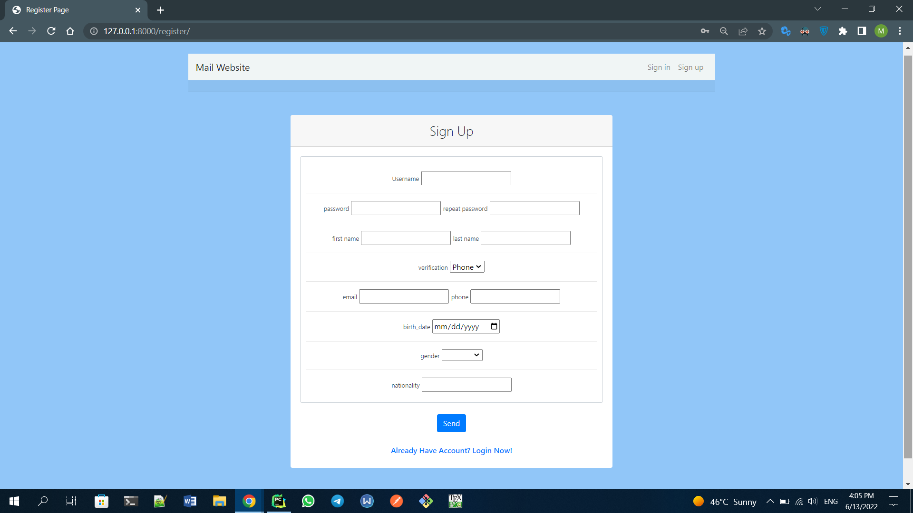
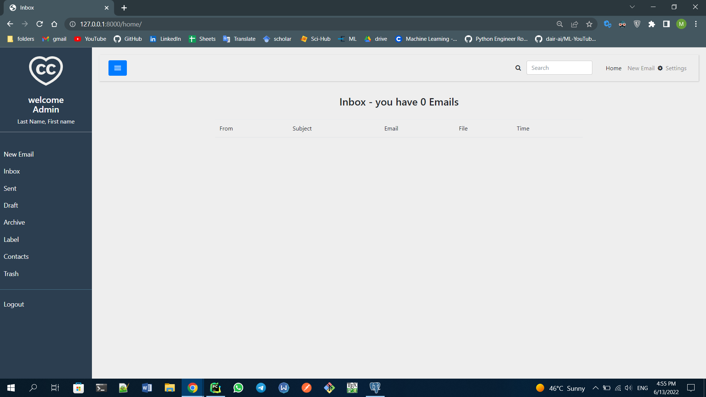
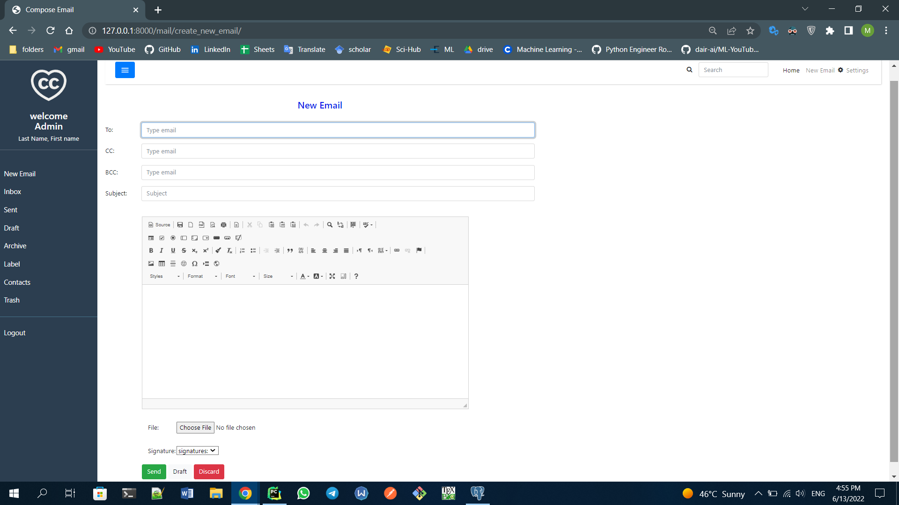
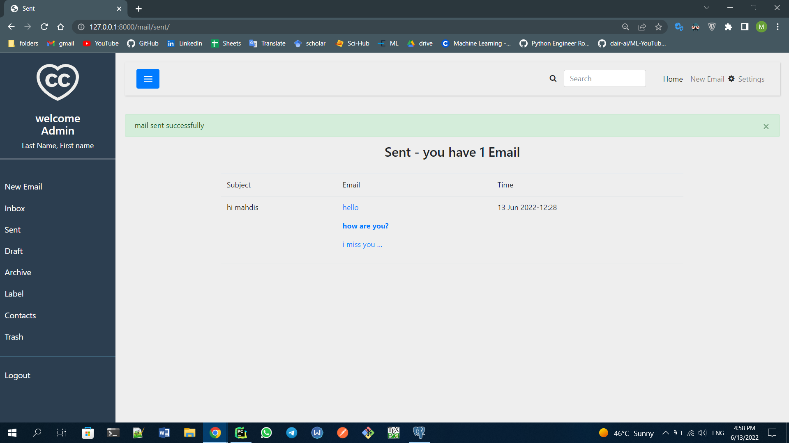
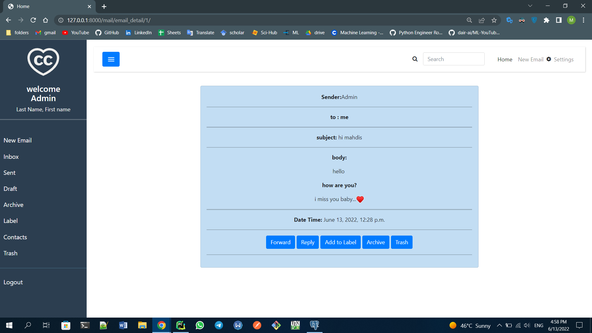
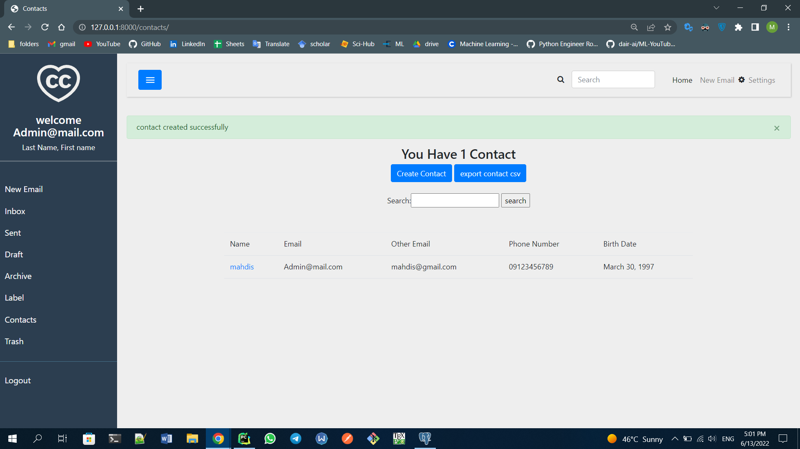
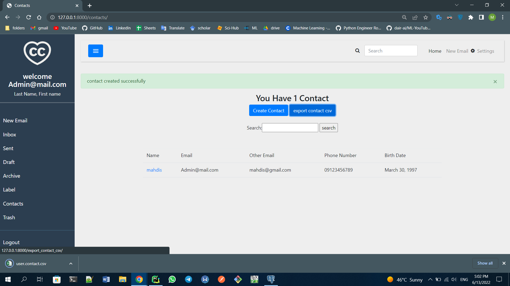
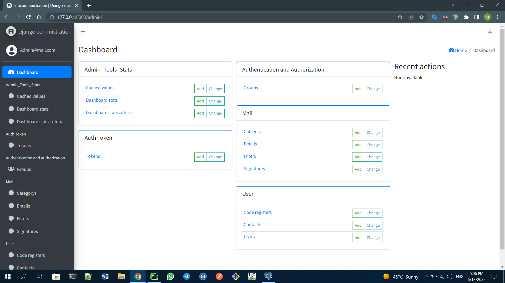

# Maktab-Final-Project
***Website for email***

**Email project required technologies:**

**Back-end: Python, Django**

**Front-end: HTML, CSS, JS + Bootstrap, jQuery**

**Database:postgreSQL**

**This website has the ability to send and receive emails and includes the required sections for managing emails, managing contacts and website appearance settings.**

**First page:**

**Sign In :**

**Sign Up :**

**Home Page:**

**Create New Email:**

**Sent email:**

**detail of email:**

**Create contact:**

**Export contacts in csv file :**

**Admin Dashboard :**

